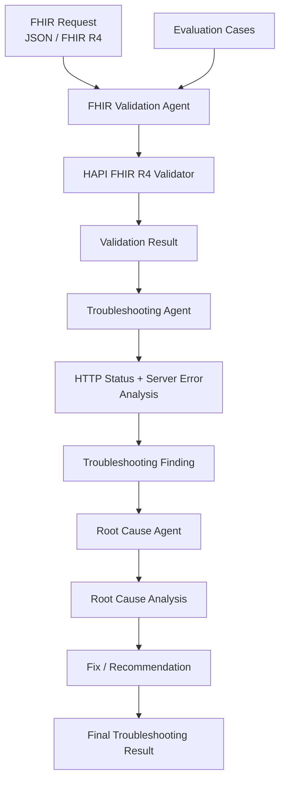

# FHIRGuard

## Agentic AI based FHIR Troubleshooting Assistant

FHIRGuard is a small MVP that I built to help developers troubleshoot **HL7 FHIR R4 API issues**.

When a FHIR API fails, getting the actual error is usually not enough. We still need to understand what caused the problem and what needs to be changed in the request.

FHIRGuard tries to simplify this process by breaking the troubleshooting into different steps using specialized agents.

---

## What problem does it solve?

While working with FHIR APIs, errors can come from different places.

For example:

* A required field may be missing
* The FHIR resource may not be valid
* A field may contain an incorrect value
* A FHIR profile may have additional requirements
* The target FHIR server may have its own constraints
* The HTTP response may not clearly explain the actual root cause

Normally, a developer has to go through the error, validate the resource, check the FHIR specification or profile, and then figure out what needs to be fixed.

The idea behind FHIRGuard is to bring these troubleshooting steps together in one workflow.


## Who is facing this problem?

FHIR troubleshooting is mainly a day-to-day problem for developers and teams working on healthcare integrations.

Some of the people who can face this problem are:

* **FHIR / Healthcare Integration Developers** - They work with FHIR APIs and regularly investigate validation and server errors.
* **Backend Developers** - Developers building backend services may know how to work with REST APIs but may not always know every FHIR rule or implementation-specific requirement.
* **Interoperability Engineers** - They often need to understand why the same FHIR resource works with one system but is rejected by another.
* **EMR/EHR Integration Teams** - These teams connect healthcare applications and systems and may have to deal with different FHIR profiles and server-specific constraints.
* **QA and API Testing Teams** - They need to understand why a FHIR request failed so that the issue can be reproduced and reported properly.
* **Developers who are new to a particular FHIR implementation** - Even if they understand FHIR, a target server can have additional requirements that are not immediately obvious from the error message.

### What makes the problem difficult?

The difficult part is not always getting the HTTP error.

For example, a developer might receive:

```text
HTTP 400
Patient.name.family is required
```

---

## How does FHIRGuard work?

The current MVP follows this flow:

```text
FHIR Request
     |
     v
FHIR Validation Agent
     |
     v
Troubleshooting Agent
     |
     v
Root Cause Agent
     |
     v
Fix / Recommendation
```

---

## Architecture

FHIRGuard follows a simple agent-based troubleshooting workflow. The FHIR request is first validated, then the validation result and server response are analyzed to identify the likely root cause and recommend a fix.



### Main components

- **FHIR Validation Agent** – parses and validates the FHIR R4 resource.
- **HAPI FHIR Validator** – performs the configured FHIR validation.
- **Troubleshooting Agent** – analyzes the validation result together with the HTTP response and server error.
- **Root Cause Agent** – identifies the likely reason for the failure.
- **Fix / Recommendation** – provides the next action for the developer.
- **Evaluation Cases** – provides repeatable scenarios for testing the workflow.

Each step has a specific responsibility.

### 1. FHIR Validation Agent

The FHIR resource is parsed and validated using **HAPI FHIR**.

This helps identify whether the resource is valid according to the configured FHIR validation rules.

### 2. Troubleshooting Agent

The troubleshooting agent looks at the available information, such as:

* FHIR request
* HTTP status
* Error message
* Validation result

It then tries to understand what type of problem occurred.

### 3. Root Cause Agent

The root cause step goes one level further and tries to explain **why the problem happened**.

For example, a FHIR resource may pass basic FHIR validation but still fail when sent to a particular server because that server or profile expects an additional field.

### 4. Recommendation

Finally, FHIRGuard provides a suggested action that can help the developer correct the request.

---

## Example

Consider this Patient resource:

```json
{
  "resourceType": "Patient",
  "name": [
    {
      "given": [
        "John"
      ]
    }
  ]
}
```

Suppose the target server or profile requires a family name.

The troubleshooting process can identify:

```text
Issue:
Patient.name.family is required by the target configuration.

Root Cause:
The request does not contain the required family name.

Suggested Fix:
Add Patient.name.family to the Patient resource.
```

One important point here is that **FHIR base validation and target-server validation are not always the same thing**.

A resource can pass the basic FHIR validation configured in the application and still be rejected by a particular implementation or profile.

This is one of the situations FHIRGuard is designed to help explain.

---

## Why use agents?

I did not want the project to be just a chatbot where a user enters an error and gets a generated response.

The troubleshooting process is divided into separate steps:

```text
Validate
   ↓
Understand the error
   ↓
Find the likely root cause
   ↓
Suggest a fix
```

Each agent has a different responsibility and uses the result from the previous step.

This makes the troubleshooting flow easier to follow and also gives me a way to add more diagnostic capabilities later.

---

## Technology Used

* **Java 17**
* **Spring Boot**
* **HAPI FHIR**
* **HL7 FHIR R4**
* **Maven**
* **Jackson**
* **JUnit**
* **REST APIs**
* **OpenAI API** for optional LLM-based reasoning
* **Docker / AWS** for deployment possibilities

---

## Project Structure

The project follows a simple Spring Boot structure.

```text
FHIRGuard
│
├── src
│   ├── main
│   │   ├── java
│   │   └── resources
│   │
│   └── test
│
├── pom.xml
└── README.md
```

The main application contains the FHIR validation, troubleshooting, root-cause analysis, and evaluation components.

---

## Running the Project

### Prerequisites

Make sure the following are installed:

* Java 17 or later
* Maven 3.8+
* Git

### Clone the project

```bash
git clone <YOUR_GITHUB_REPOSITORY_URL>
cd FHIRGuard
```

### Build

```bash
mvn clean install
```

### Run

```bash
mvn spring-boot:run
```

The application can also be started using the generated JAR file.

```bash
java -jar target/<application-name>.jar
```

---

## Running the MVP without an API key

The MVP can also be run in local mode.

For example:

```properties
fhirguard.llm-enabled=false
```

This is useful for demonstrating the core troubleshooting workflow without depending on an external LLM service.

If LLM functionality is enabled, the required API key should be configured through an environment variable or another secure configuration mechanism.

**API keys should never be committed to the repository.**

Example:

```bash
export OPENAI_API_KEY=<your-api-key>
```

---

## Evaluation

I included a set of evaluation cases to check how the troubleshooting workflow behaves with different FHIR scenarios.

The cases cover situations such as:

| Scenario                    | Expected Result                    |
| --------------------------- | ---------------------------------- |
| Missing required field      | Identify the missing field         |
| Invalid FHIR resource       | Report the validation problem      |
| Invalid field/value         | Identify the problematic value     |
| Target-specific requirement | Explain the additional requirement |
| Valid resource              | Identify the request as valid      |

The evaluation cases are used to run the complete workflow and check the generated troubleshooting results.

---

## Current MVP

The current version demonstrates:

* FHIR R4 resource parsing
* FHIR validation using HAPI FHIR
* Multi-step troubleshooting
* Root-cause analysis
* Fix recommendations
* Evaluation cases
* Local execution
* Optional LLM integration

The focus of this version is to demonstrate the **core idea and end-to-end workflow** rather than provide a production-ready healthcare platform.

---

## What I would like to add next

There are several areas I would like to improve in future versions.

### FHIR Profile Support

Add better support for implementation guides and FHIR profiles so that the system can distinguish between standard FHIR requirements and implementation-specific requirements.

### FHIR Knowledge Base

Use FHIR specifications and implementation guides as a knowledge source so that troubleshooting recommendations can be better grounded in FHIR documentation.

### Real FHIR Server Testing

Connect the application to real FHIR servers and use the actual server response as part of the troubleshooting process.

### Automatic Re-validation

A future version could generate a corrected FHIR request and automatically validate it again.

For example:

```text
Request
   ↓
Validation
   ↓
Error
   ↓
Root Cause
   ↓
Generate Fix
   ↓
Apply Fix
   ↓
Validate Again
```

### More Healthcare Standards

The same approach could eventually be extended to other healthcare integration problems involving HL7 v2, DICOM, and EMR/EHR integrations.

---

## Why I built this

FHIR interoperability problems can sometimes take a significant amount of time to troubleshoot, especially when the error message doesn't clearly explain the actual reason for rejection.

The goal of FHIRGuard is simple:

> **Help developers move from "What is this FHIR error?" to "Why did it happen and what should I change?"**

This MVP is my first step toward that idea using an agent-based troubleshooting workflow.

---

## Disclaimer

FHIRGuard is currently an MVP/prototype created for demonstration and development purposes.

The recommendations generated by the system should be reviewed by a developer or healthcare interoperability expert before being used in a production healthcare environment.

---

## Author

**Sneha Karthikeyan**

Software Engineer
Java | Spring Boot | HL7 FHIR | Healthcare Interoperability
